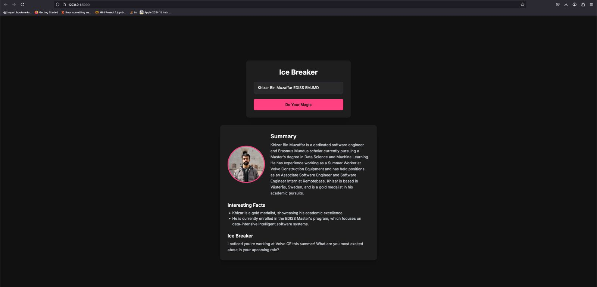

# Ice Breaker

Ice Breaker is an AI-powered project that transforms basic personal information into engaging insights by generating a
profile summary, two interesting facts, and a personalized conversation starter (ice breaker) question—all derived from
a person's LinkedIn profile.



## Overview

This project combines several cutting-edge technologies to deliver a unique user experience:

1. **Input:** The user provides a person's name (and additional info if needed).
2. **LinkedIn URL Search:** An AI agent searches for the person's LinkedIn URL using Tavily search.
3. **Data Scraping:** The person's LinkedIn profile is scraped using Scrapin.io to extract relevant details.
4. **LLM Processing:** The scraped data is fed into a Large Language Model (LLM) which generates:
    - A short summary of the person.
    - Two interesting facts about them.
    - An ice breaker question that serves as a conversation starter.

The final output is presented on a modern, dark-themed web UI.

## Features

- **Automated LinkedIn Discovery:** Utilizes Tavily search to locate the correct LinkedIn profile.
- **Robust Data Extraction:** Scrapin.io extracts detailed profile information.
- **Intelligent Content Generation:** An LLM creates a tailored summary, interesting facts, and a conversation starter.
- **Sleek Dark UI:** A polished and responsive interface built with Flask and Tailwind CSS.

## How It Works

1. **User Input:** The application accepts a person's name and other identifying details.
2. **Profile Search:** The system queries Tavily search to find the appropriate LinkedIn URL.
3. **Scraping Process:** Using Scrapin.io, the LinkedIn profile is scraped for data such as the profile picture, work
   history, and more.
4. **LLM Integration:** The scraped information is processed by an LLM, which generates:
    - A concise summary.
    - Two interesting facts about the person.
    - A creative ice breaker question.
5. **Presentation:** The results (including the profile picture) are displayed on a dark-themed, modern web interface.

## Requirements

- **Python Version:** 3.11
- **Backend Framework:** [Flask](https://flask.palletsprojects.com/)
- **Environment Management:** [python-dotenv](https://github.com/theskumar/python-dotenv)
- **LLM Integration:** [LangChain](https://langchain.com/) and its related modules (
  e.g., `langchain_core`, `langchain_openai`, `langchain_ollama`)
- **Data Scraping:** Scrapin.io for LinkedIn data extraction
- **LinkedIn Search:** Tavily search for discovering LinkedIn profile URLs

## Installation

1. **Clone the Repository:**

   ```bash
   git clone https://github.com/yourusername/ice-breaker.git
   cd ice-breaker
   ```

2. **Create and Activate a Virtual Environment:**

   ```bash
   python -m venv venv
   source venv/bin/activate  # On Windows: venv\Scripts\activate
   ```

3. **Install Dependencies:**

   ```bash
   pip install -r requirements.txt
   ```

4. **Configure Environment Variables:**

    - Create a `.env` file in the root directory.
    - Add your necessary API keys and configuration variables (e.g., for the LLM, Scrapin.io, and Tavily search).

## Usage

1. **Run the Flask Application:**

   ```bash
   python app.py
   ```

2. **Access the Application:**

   Open your browser and navigate to [http://localhost:5000](http://localhost:5000).

3. **Generate Insights:**

    - Enter the name of the person (and any additional info if needed).
    - Click the "Do Your Magic" button.
    - View the resulting profile summary, interesting facts, and the ice breaker question on the screen.

## Project Structure

```

├── agents/                           # Contains lookup agents for social media platforms
│   ├── __init__.py                   # Initializes the agents package
│   ├── linkedin_lookup_agent.py      # Implements the LinkedIn lookup functionality
│  
├── templates/                        # HTML templates for the Flask web interface
│   ├── index.html                    # Main user interface template
│  
├── third_parties/                    # Integrations with third-party services/APIs
│   ├── __init__.py                   # Initializes the third_parties package
│   ├── linkedin.py                   # Contains functions for LinkedIn scraping/API interactions
│  
├── tools/                            # Utility modules and helper functions used across the project
│   ├── __init__.py                   # Initializes the tools package
│   ├── tools.py                      # Various utility functions and helpers
│  
├── .env                              # Environment configuration file (stores sensitive keys and settings)
├── .gitignore                        # Specifies files and directories to be ignored by Git
├── app.py                            # Entry point for the Flask web application
├── ice_breaker.py                    # Main module orchestrating scraping and LLM interactions
├── LICENSE                           # License file for the project
├── output_parsers.py                 # Module for parsing and formatting outputs from the LLM

```

## Acknowledgements

- **Scrapin.io:** For providing the scraping functionality.
- **Tavily Search:** For facilitating the discovery of LinkedIn URLs.
- **LangChain:** For enabling seamless LLM integration.
- **Open Source Community:** For all the incredible libraries and resources that make this project possible.

## License

This project is licensed under the [MIT License](LICENSE).
edible libraries and resources that make this project possible. ## License This project is licensed under
the [MIT License](LICENSE).